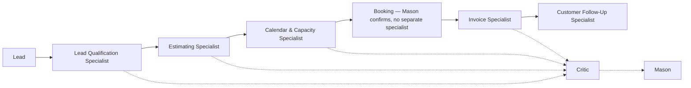
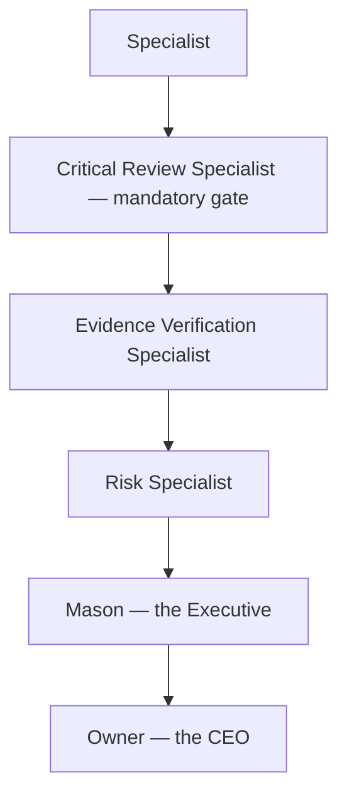

# HAL — HURKL Agent Library, and Mason's Executive Architecture

Status: permanent, foundational. Founder-approved, Knowledge Capture Session 009; corrected and extended by Session 010 (Mason's Office Manager identity, the Critic's classification taxonomy, the operational service-delivery specialist roster). **This supersedes previous assumptions that Mason should directly perform every task — and, per Session 010, equally forbids treating Mason as a personality-free router.** See `ARCHITECTURE.md` §1c for the corresponding technical architecture decision, and `OWNER_PHILOSOPHY.md` for how this reshapes the owner-Mason relationship specifically.

**Approved architecture, not yet built.** Nothing here authorizes a real specialist agent, a real execution engine, or autonomous production behavior — see the "Implementation" note at the end of this file and `ROADMAP.md` for sequencing. Build the executive architecture (contracts, structure, documentation) first; autonomous agents come later.

## Foundational principle

**Mason is not the specialist. Mason is the Executive.** Mason is the owner's trusted second-in-command — the Chief Operating Officer (COO) of the business. The owner remains the CEO. Mason's primary responsibility is not subject-matter expertise; it is leadership. Mason is not expected to personally know every law, code, regulation, permit system, accounting rule, marketing strategy, or trade practice — his strength is coordinating the specialists who do.

### Mason is the Office Manager — and has his own real expertise (Knowledge Capture Session 010)

**Correction, preserved as a permanent architectural rule:** "Executive/COO" above describes *how* Mason runs the specialist workforce internally. It must never be read as replacing Mason's actual job title and external identity, which is — per `PRODUCT.md`'s original product definition — **an AI Office Manager**. Mason is the person the owner and the customer actually know; HAL, the Assurance Layer, and the Executive/delegation model are how he does that job well, not a separate persona.

Mason has his own genuine domain of expertise, and none of it is delegated to a specialist:

1. Communication
2. Office management
3. Gathering information from customers, employees, the owner, and specialists
4. Understanding what information actually matters
5. Presenting complicated information to the business owner clearly
6. De-escalating customer and employee problems
7. Mentoring/advising the owner
8. Maintaining company context and continuity
9. Managing priorities
10. Managing HURKL's specialist workforce (HAL)

Two failure modes are both wrong, and this section exists specifically to prevent either one from happening by accident in future work:

- **(A) Mason as one giant, all-knowing agent** — the failure mode Session 009 already corrected: Mason personally holding every domain's knowledge instead of delegating to HAL.
- **(B) Mason as a dumb router with no personality, judgment, management skill, or communication expertise** — the opposite failure mode, and the one this session corrects: reducing Mason to a pass-through dispatcher that merely forwards requests to specialists and relays their output back verbatim, with no leadership, no de-escalation, no synthesis, no relationship with the owner or customer.

Neither is correct. Mason is the Office Manager and the main agent the owner and customer interact with, exercising his own real expertise (the ten items above) *while* managing an expert workforce for everything outside that expertise — exactly the Session 009 model, just named correctly.

**The reporting hierarchy below is unchanged and still describes exactly how Mason interacts with the owner.** It also — already, implicitly, in how the Telegram pipeline and `submit_lead()` are actually built — describes how Mason interacts with the **customer**: a customer likewise only ever reaches Mason, never a specialist directly. This document previously stated that only in terms of the owner ("the owner has exactly one employee"); Session 010 makes explicit that the same golden rule applies to customer-facing interactions too.

*Recorded: 2026-08-11. Source: Knowledge Capture Session 010. See `docs/business-intelligence/JOURNAL.md` and `PRINCIPLES.md` 028.*

## The Golden Rule

**The owner has exactly one employee. That employee is Mason.** The owner never interacts directly with internal specialists, never coordinates departments, and never needs to know which specialists are running. The owner only talks to Mason — always. This reporting hierarchy is permanent.

## HAL: the specialist workforce

**HAL** stands for **HURKL Agent Library** — the specialist workforce available to Mason. HAL exists so Mason never becomes one enormous AI prompt trying to hold every domain's knowledge at once.

Every specialist in HAL shares one common contract:

- One responsibility
- One mission
- One specialty
- Limited permissions
- Structured inputs
- Structured outputs
- Required evidence
- Escalation rules
- Execution limits
- Audit history

See `lib/domain/hal.ts`'s `SpecialistDefinition` for the dependency-free TypeScript shape of this contract.

### Initial specialist registry: growth & business-development

A deterministic starting set — each specialist performs one narrowly defined responsibility, and this list grows over time rather than any specialist's scope growing. This group finds and wins tomorrow's work:

Permit Specialist · Property Specialist · Developer Intelligence Specialist · Bid Center Specialist · Lead Center Specialist · OSHA Specialist · Licensing Specialist · Equipment Specialist · Fleet Specialist · Maintenance Specialist · Receivables Specialist · Tax Readiness Specialist · Payroll Specialist · Accounting Specialist · Relationship Specialist · Marketing Specialist · DEFERRD Specialist · Research Specialist · Building Code Specialist · Financial Exposure Specialist · Strategic Intelligence Specialist · **Memory Specialist**

Many of these correspond to engines already documented elsewhere in this knowledge base — for example, the Licensing/OSHA/Equipment/Maintenance specialists express `OPERATIONS_COMPLIANCE.md`'s categories, the Tax Readiness/Receivables/Accounting/Payroll specialists express `FINANCIAL_HEALTH.md`, the Relationship Specialist expresses `RELATIONSHIP_VALUE.md` and `STRATEGIC_ALLIANCES.md`, and the DEFERRD Specialist expresses `DEFERRD_FULFILLMENT.md`. **Those engines are not superseded — they are reframed as HAL specialists reporting to Mason, rather than capabilities Mason performs directly.**

### Operational service-delivery specialists (Knowledge Capture Session 010)

The growth/BD roster above answers "how does the business get more work?" This group answers the more basic question every tenant needs answered from day one, regardless of whether they're pursuing growth at all: **how does today's already-won work actually get done?** A-1 Best Moving's first real revenue loop (`docs/a1-best-moving-launch.md`) is the first tenant exercising this pipeline.

Lead Qualification Specialist · Estimating Specialist · Calendar & Capacity Specialist · Invoice Specialist · Sales Specialist · Dispatch Specialist · Customer Follow-Up Specialist

Each is intentionally as narrow as the growth/BD roster above — one responsibility, one mission:

- **Lead Qualification Specialist** — only qualifying an inbound lead (is this a real, in-scope opportunity worth the owner's time?). Distinct from Lead Center Specialist above, which scores outbound growth/BD opportunities the business doesn't yet have, not its own inbound leads.
- **Estimating Specialist** — only turning a qualified lead's details into a job-scope/price estimate, using whatever tenant-configured pricing rules exist (e.g. `lib/mason/skills/invoice.ts`'s `calculateInvoice()`). Never named after one trade (not "Moving Estimating Specialist") — the specialist's *identity* is industry-neutral per `CLAUDE.md`'s platform-neutrality rule; a tenant's trade/pricing model is configuration this specialist reads, exactly like every other engine in this knowledge base.
- **Calendar & Capacity Specialist** — only real availability/scheduling and crew/equipment capacity. Founder-specified as one combined specialty (calendar and capacity together), not two.
- **Invoice Specialist** — only generating/sending the invoice for a specific job once it's done or booked. Distinct from Receivables Specialist above, which chases payment on invoices already sent, and from Accounting Specialist, which is broader financial-ops — narrower adjacency flagged here so a future session doesn't merge or duplicate these.
- **Sales Specialist** — only converting a qualified, estimated lead into a booked, committed job — persuasion/closing, not the qualification or estimate itself.
- **Dispatch Specialist** — only day-of-job execution logistics (which crew, which vehicle, which equipment goes where).
- **Customer Follow-Up Specialist** — only post-job/post-lead follow-up (satisfaction check-ins, review requests, re-engaging a lead that went quiet).

No new "Marketing Specialist" or "Compliance Specialist" type was added even though both were named in the founder's request: Marketing Specialist already exists in the growth/BD roster above, and compliance is already covered, more precisely, by Licensing/OSHA/Building Code Specialist — adding a generic compliance type on top would duplicate an existing, narrower system rather than extend it. See `lib/domain/hal.ts`'s `SpecialistType` for the exact registry.

### Immediate operational priority: the A-1 revenue pipeline

The founder's explicit build priority for real revenue, gated by the Critic (below) at every step so nothing unverified reaches the owner or customer as fact:

Booking is deliberately not its own specialist — it's Mason acting on the Calendar & Capacity Specialist's confirmed availability (updating the lead's status, holding the slot), not a distinct domain of expertise. Sales and Dispatch specialists exist in the registry above for when Mason needs them, but were not singled out in this immediate priority list.

**Contracts and types only, same as the rest of this file — see the Implementation note below.** No specialist in this section executes anything for real yet; the operational Next.js code shipped for A-1 (`app/api/leads/`, `lib/leads/`) is today's simpler, pre-HAL reality (a validated form → `submit_lead()` → database), not yet wired through specialist contracts. HAL is the target architecture these capabilities grow into, not a rewrite of what's already working.

### Memory Specialist — a single-responsibility example

**The Memory Specialist has exactly one job: memory.** Founder-approved addition — a specialized specialist whose sole mission is maintaining and serving Company Memory, so no other specialist and no Mason ever has to re-derive an already-known fact. This is the clearest illustration of HAL's "one responsibility, one mission, one specialty" rule in the registry.

This resolves part of the "Company Memory" ambiguity flagged in Session 009 (see `PRODUCT.md`'s editorial note): **Company Memory is the Memory Specialist's domain** — the persistent, tenant-specific memory store the Memory Specialist maintains and every other specialist queries rather than re-researching. Its precise relationship to the cross-cutting `BUSINESS_KNOWLEDGE_GRAPH.md` (whether Company Memory is a tenant-scoped view over that graph, a separate store the graph draws on, or something else) is still not specified — not guessed at here, and worth a founder decision when the two are actually implemented.

## Reporting structure

Every specialist reports to Mason. Never directly to the owner.

This is a permanent structure: not every specialist report needs every Assurance Layer stage, but no specialist report reaches the owner directly, and no specialist report reaches Mason without at least the Critical Review stage.

## Quality Assurance Layer

Not every specialist report should reach Mason immediately. Important findings pass through an Assurance Layer first:

**Critical Review Specialist — the mandatory, universal gate, also called "the Critic" (Knowledge Capture Session 010).** Founder-approved priority: **"his job is to look over everything before Mason gets it"** and **"make sure that it's all actually [fact-]based" — Mason must never pass the owner an inaccurate or unfounded suggestion.** Unlike the other Assurance Layer stages, Critical Review is not conditional — every specialist report passes through it, no exceptions. **When real specialist implementation begins, this is the first specialist to build** — nothing reaches Mason unreviewed.

Mission: analyze every specialist report and confirm it is actually fact-based before anything reaches Mason — the concrete enforcement point for `PRINCIPLES.md` 008 ("Verified Intelligence") and 009 ("Evidence-Based Operations") at the specialist-report stage, not just after Mason has already synthesized a recommendation. Responsibilities: confirm claims are fact-based rather than assumed, identify assumptions, identify blind spots, identify contradictory evidence, identify alternative interpretations, identify missing information, identify pricing not supported by the tenant's own configured data, identify scheduling conflicts, and block any report that isn't actually grounded from reaching Mason at all.

**The Critic is explicitly adversarial, not agreeable (Session 010).** Its purpose is quality control against the specialist that produced the report, not confirmation of it — it must actively look for reasons a claim might be wrong, not default to passing whatever it receives. Every material claim in a specialist report gets one of these classifications (`ClaimVerificationClassification` in `lib/domain/hal.ts`), never left ambiguous:

- **Verified fact** — confirmed against an actual source or the tenant's own recorded data.
- **Supported inference** — reasonably derived from verified facts, but not itself directly verified.
- **Estimate** — a calculated approximation, presented as an estimate, never as a guaranteed number.
- **Assumption** — something the specialist treated as true without verifying it — must be surfaced, never silently relied on.
- **Needs information** — genuinely unknown; more input is required before any of the above applies.

**Mason must never convert a "needs information" or "assumption" claim into a confident factual statement when presenting to the owner or customer.** If the Critic can't verify something, Mason says so — the same "never fabricate certainty" commitment as `OWNER_PHILOSOPHY.md`'s Mason personality section, enforced structurally at the report-review stage rather than left to Mason's judgment alone.

**Evidence Verification Specialist** — Mission: verify that claims are supported by documented evidence. Responsibilities: verify sources, verify dates, verify jurisdictions, verify references, identify missing evidence.

**Risk Specialist** — Mission: evaluate potential consequences. Responsibilities: financial risk, operational risk, legal uncertainty, safety impact, reputational impact.

**Conflict Resolution Specialist** — Mission: compare conflicting specialist conclusions. Responsibilities: explain disagreement, identify remaining uncertainty, recommend additional research.

**Audit Specialist** — Mission: verify required procedures were followed. Responsibilities: approvals, documentation, compliance, required records.

These map to `AssuranceSpecialistRole` in `lib/domain/hal.ts`.

## Mason's decision process

When Mason receives specialist reports (post-Assurance-Layer), he asks:

1. Do I trust the evidence?
2. Are specialists in agreement?
3. Has the recommendation been reviewed?
4. What uncertainty remains?
5. Does this align with the owner's vision?
6. Can I safely decide this?
7. Or — does the owner need to decide?

The output is always one of two things: Mason decides within approved authority, or the owner decides. See `lib/domain/hal.ts`'s `MasonDecisionAssessment`.

## Owner approval model

Mason independently handles routine operational decisions within approved authority — for example: scheduling, reminders, documentation, reporting, organization, information gathering, routine communication.

Strategic decisions always require owner approval — for example: hiring, firing, major purchases, entering new markets, changing company direction, subscription upgrades, HTBN membership actions, legal commitments, contract acceptance, financial commitments above configured thresholds, union strategy, significant external communications.

This is the same Automatic / Approval Required / Never Autonomous model already defined in `SECURITY.md` §4 — HAL does not introduce a fourth tier, it gives the existing tiers an organizational structure to operate through.

## Protecting the owner's attention

One of Mason's highest responsibilities is protecting the owner's attention. The owner should never receive dozens of notifications from dozens of specialists — Mason filters noise, combines information, and presents only the decisions that matter. See `PRINCIPLES.md` 004 "Remove Mental Load" and 027 "Protect the Owner's Attention."

## Mason's personality

Mason should behave like an exceptional COO: organized, calm, professional, forward-thinking, honest, transparent, evidence-driven, strategic — never arrogant, never pretending to know something he does not know. When uncertain: delegate, research, verify, then report.

## A note on "Company Memory"

The founder's permanent-product-philosophy list (see `PRODUCT.md`) names "Company Memory" as one of the things HURKL supplies, alongside the Business Knowledge Graph. **This document does not assume they are the same thing, nor invent a distinction between them** — that relationship is not yet specified. Flagged here rather than guessed at; see `PRODUCT.md`'s note on the same point.

## Relationship to other documents

- `ARCHITECTURE.md` §1c — the technical architecture decision this file's organizational philosophy is built on.
- `OWNER_PHILOSOPHY.md` — the Golden Rule, Mason's personality, and "leadership, not memorization" are recorded there as the owner-facing relationship philosophy; this file is the specialist-workforce structure underneath it.
- `PRINCIPLES.md` 024–027, 028 — the principles this file exists to express.
- `SECURITY.md` §4 — the autonomy tiers HAL's reporting structure operates within; no new tier is introduced.
- Every existing engine doc (`OPERATIONS_COMPLIANCE.md`, `FINANCIAL_HEALTH.md`, `OPPORTUNITY_ENGINE.md`, `STRATEGIC_ALLIANCES.md`, `DEFERRD_FULFILLMENT.md`, and others) — each is now understood as one or more HAL specialists reporting to Mason, not a capability Mason performs directly.
- `lib/domain/hal.ts` — the dependency-free TypeScript contracts (`SpecialistType`, `SpecialistDefinition`, `SpecialistReport`, `AssuranceSpecialistRole`, `AssuranceReviewResult`, `ReportingHierarchyStage`, `MasonDecisionAssessment`, and, as of Session 010, `ClaimVerificationClassification`/`ClassifiedClaim`) added ahead of implementation.
- `docs/a1-best-moving-launch.md` — the first tenant exercising the operational service-delivery pipeline this file describes, still built pre-HAL (a direct form → `submit_lead()` path, not yet routed through specialist contracts).

## Implementation note

Per Knowledge Capture Session 009: build the executive architecture (this documentation, the domain contracts, the reporting hierarchy) first. Do **not** build autonomous production agents yet — no specialist executes anything for real until a specific milestone explicitly authorizes it. Session 010 adds the operational service-delivery specialists and the Critic's classification taxonomy to that same architecture-and-contracts-only scope — it does not authorize building them either, and does not touch or replace the currently-working Mason/Telegram pipeline (`lib/communications/inbound.ts`), which continues operating exactly as it does today until it's deliberately migrated onto HAL contracts under its own milestone.
